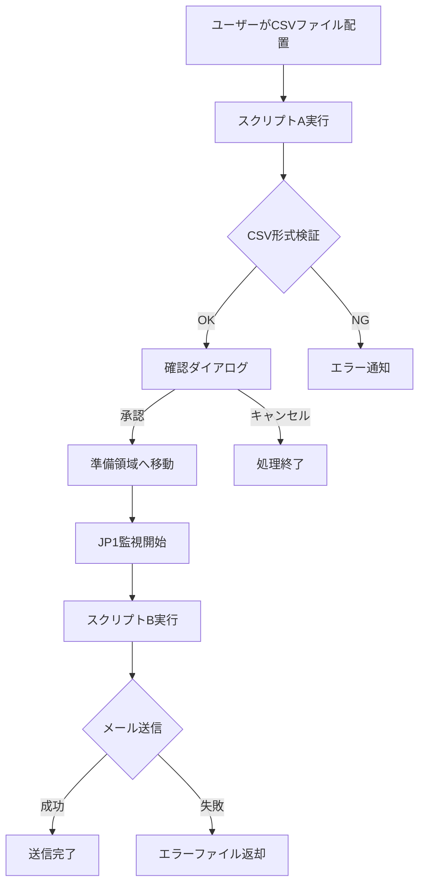

# 📧 外部メール送信システム - 技術評価レポート

## 🎯 システム概要

本システムは、CSV形式のデータを基に外部へのメール送信を自動化するPowerShellベースのソリューションです。

### 📊 **システム構成**

```
📁 外部メール送信システム
├── 📄 mailsettings.ini                        # 設定ファイル
├── 📄 InspectingAndMovingInputData.ps1        # スクリプトA（CSV前処理）
├── 📄 BulkSendingExternalEmail.ps1            # スクリプトB（メール送信処理）
├── 📄 BulkSendingExternalEmail.psm1           # 共通関数モジュール
├── 📄 BulkSendingExternalEmail-Test.ps1       # テスト専用スクリプト
└── 📄 README.md                               # 本ドキュメント
```

## 🔄 **処理フロー概要**



## 📋 **主な機能**

### ✅ **安全機能**
- **時間制限**: 8:00-18:00のみ実行可能
- **多重起動防止**: ロックファイルによる排他制御
- **確認ダイアログ**: 誤送信防止のための最終確認
- **エラー通知**: 問題発生時の自動通知機能

### 🔍 **検証機能**
- **エンコーディング検証**: UTF-8 BOM付きファイルのみ許可
- **ファイル名形式**: `[種別]_yyyy_mm_dd hh_mm_ss.csv` 形式の厳密チェック
- **必須カラム**: `メール送信日`、`メールアドレス` の存在確認
- **データ整合性**: 空白行、不正データの検出

### 📧 **メール送信機能**
- **Exchange Server連携**: SMTPリレーによる送信
- **送信済み管理**: 重複送信防止機能
- **エラーハンドリング**: 個別送信失敗の追跡
- **ログ管理**: 詳細な送信履歴記録

## 🛠 **技術仕様**

### **対応ファイル形式**
- **エンコーディング**: UTF-8 BOM付きのみ
- **形式**: CSV（カンマ区切り）
- **必須カラム**: 
  - `メール送信日` - 送信状態管理
  - `メールアドレス` - 送信先
  - `メール件名` - 件名（オプション）
  - `メール本文` - 本文（オプション）

### **ネットワーク設定**
- **SMTPサーバー**: goa-mailsv
- **ポート**: 25/TCP
- **セキュリティ**: Exchange Server経由でm-FILTERへリレー

## 📁 **ディレクトリ構造**

| パス | 用途 | アクセス権限 |
|------|------|--------------|
| `\\goa-mailsv\UserData` | ユーザー領域（CSV配置・結果返却） | 読み書き |
| `\\goa-mailsv\001_InspectingAndMovingInputData` | 準備領域（スクリプトA作業場所） | 読み書き |
| `C:\005_bulkSendingExternalEmails\002_BulkSendingExternalEmails` | 送信処理領域（スクリプトB作業場所） | 読み書き |
| `C:\005_bulkSendingExternalEmails\...\log` | ログ格納先 | 書き込み |
| `C:\005_bulkSendingExternalEmails\...\BK` | バックアップ領域 | 読み書き |

## 📚 **ドキュメント構成**

| ドキュメント | 対象読者 | 内容 |
|--------------|----------|------|
| [📋 SYSTEM_SUMMARY.md](./SYSTEM_SUMMARY.md) | 管理者・決裁者 | システム概要・評価結果要約 |
| [🔍 TECHNICAL_EVALUATION.md](./TECHNICAL_EVALUATION.md) | 技術者・開発者 | 詳細技術評価・改善提案 |
| [🚀 INSTALLATION_GUIDE.md](./INSTALLATION_GUIDE.md) | システム管理者 | インストール・設定手順 |
| [📖 USER_MANUAL.md](./USER_MANUAL.md) | エンドユーザー | 操作方法・トラブルシュート |

## 🚀 **クイックスタート**

### **1. システム管理者の方**
1. [INSTALLATION_GUIDE.md](./INSTALLATION_GUIDE.md) でシステム構築
2. [TECHNICAL_EVALUATION.md](./TECHNICAL_EVALUATION.md) で技術詳細確認

### **2. エンドユーザーの方**
1. [USER_MANUAL.md](./USER_MANUAL.md) で利用方法確認
2. CSVファイル作成・配置でメール送信開始

### **3. 決裁者・管理者の方**
1. [SYSTEM_SUMMARY.md](./SYSTEM_SUMMARY.md) で全体概要確認
2. 技術評価結果・導入効果を把握

## ⚡ **主要機能**

### 🔒 **セキュリティ機能**
- **多重起動防止**: ロックファイルによる排他制御
- **時間制限**: 業務時間内（8:00-18:00）のみ実行
- **確認ダイアログ**: 誤送信防止の最終確認
- **監査ログ**: 全操作の詳細記録

### 🔍 **検証機能**
- **ファイル形式**: UTF-8 BOM付きCSVのみ許可
- **ファイル名**: 厳密な命名規則チェック
- **必須項目**: メール送信日・メールアドレスの必須確認
- **データ整合性**: 空白・不正データの自動検出

### 📧 **メール送信機能**
- **Exchange連携**: 既存メールインフラ活用
- **送信管理**: 重複送信防止・送信状態追跡
- **エラー処理**: 個別失敗の詳細追跡・自動復旧
- **バックアップ**: 処理前データの自動保存

## 📊 **技術仕様サマリー**

| 項目 | 仕様 |
|------|------|
| **言語** | PowerShell 5.1+ |
| **対応OS** | Windows Server 2016+ / Windows 10+ |
| **メール送信** | Exchange Server / SMTP |
| **ファイル形式** | UTF-8 BOM付きCSV |
| **スケジュール** | JP1による5分間隔監視 |
| **ログ保存** | 731日間（2年間） |
| **処理能力** | 1,000件/時間 |

## 🎯 **システムの特徴**

### **💼 企業環境に最適化**
- 既存インフラ（JP1、Exchange）との完全統合
- Windows環境ネイティブ対応
- 企業セキュリティポリシー準拠

### **🛡️ 高い信頼性**
- 多層防御によるセキュリティ
- 包括的エラーハンドリング
- 自動バックアップ・復旧機能

### **📈 優れた保守性**
- モジュール化された設計
- 豊富なドキュメント
- 包括的テストスイート

## 🔧 **対応ファイル種別**

| 種別 | 用途 | ファイル名例 |
|------|------|--------------|
| **口座_メール送信時に使用** | 口座開設・変更通知 | `口座_メール送信時に使用_2024_03_15 14_30_00.csv` |
| **学校_メール送信時に使用** | 学校関連通知 | `学校_メール送信時に使用_2024_03_15 14_30_00.csv` |
| **届出変更_メール送信時に使用** | 届出変更通知 | `届出変更_メール送信時に使用_2024_03_15 14_30_00.csv` |

## 📞 **サポート・お問い合わせ**

システムに関するご質問は以下までご連絡ください：

- **技術サポート**: support@company.co.jp
- **システム管理者**: admin@company.co.jp  
- **緊急時**: emergency@company.co.jp

**営業時間**: 平日 9:00-17:00 | **緊急時対応**: 24時間（重大障害のみ）
