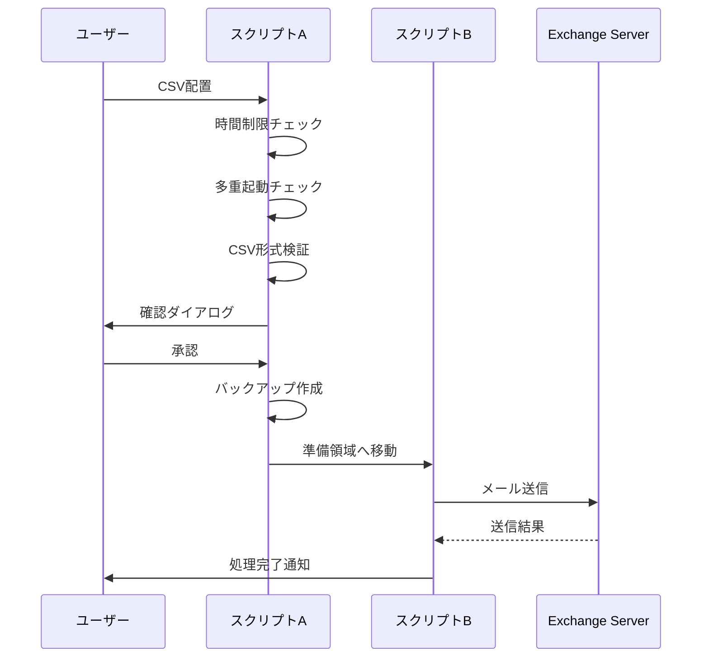

# 📊 技術評価・分析レポート

## 🎯 **評価観点**

### 1. **正常/エラー処理フローの妥当性・安全性・ログ出力**

#### ✅ **優れている点**

**多層防御アプローチ**
- **時間制限**: 8:00-18:00の業務時間内のみ実行可能
- **多重起動防止**: ロックファイル (`起動中.txt`) による排他制御
- **確認ダイアログ**: 送信前の最終確認で誤送信を防止
- **エラー通知フォルダ**: 問題発生時の自動通知機能

**包括的ログ管理**
```powershell
# ログレベル別出力
Write-Log "処理開始" 'INFO'
Write-Log "警告事項" 'WARN'  
Write-Log "エラー発生" 'ERROR'
Write-Log "詳細情報" 'VERBOSE'  # VerboseLogスイッチ時のみ
```

**段階的処理フロー**


#### ⚠️ **改善が必要な点**

**エラーハンドリングの詳細化**
- ネットワーク障害時の自動リトライ機能がない
- SMTPサーバー障害時の代替手段が未定義
- 大量送信時のレート制限考慮が不十分

**ログローテーション**
- 現在の731日保存は長すぎる可能性
- ディスク容量監視機能が不足

### 2. **CSVファイルの多様な異常パターンへの耐性**

#### ✅ **対応済み異常パターン**

**エンコーディング関連**
```powershell
# UTF-8 BOM付き厳密チェック
$bom = Get-Content -LiteralPath $FilePath -Encoding Byte -TotalCount 3
if ($bom[0] -ne 0xEF -or $bom[1] -ne 0xBB -or $bom[2] -ne 0xBF) {
    throw "CSVファイルがUTF-8 BOM付きではありません"
}
```

**ファイル名形式**
```regex
# 厳密なファイル名パターン
^[CsvKeyword]_\d{4}_\d{2}_\d{2} \d{2}_\d{2}_\d{2}\.csv$
```

**必須カラム検証**
- `メール送信日`: 送信状態管理用
- `メールアドレス`: 送信先必須
- カラム名の表記揺れ検出機能

#### ⚠️ **未対応の異常パターン**

**データ内容の詳細検証**
- メールアドレスの詳細な正規表現チェック不足
- 件名・本文の文字数制限チェックなし
- 特殊文字・制御文字のサニタイズ不足

**CSV構造の複雑なパターン**
- 引用符内のカンマ区切りデータ
- 改行を含むセルデータ
- 空行の混在パターン

### 3. **エラー通知・ロールバック・復旧可能性**

#### ✅ **実装済み機能**

**エラー通知システム**
```powershell
# エラー通知フォルダ作成
$errorFolder = Join-Path $UserData "送信処理に問題が発生しています。事務部に連絡してください"
New-Item -ItemType Directory -Path $errorFolder -Force
```

**ファイルバックアップ**
```powershell
# 処理前の完全バックアップ
$utf8WithBom = New-Object System.Text.UTF8Encoding $true
[System.IO.File]::WriteAllText($backupPath, $content, $utf8WithBom)
```

**段階的ファイル移動**
- ユーザー領域 → 準備領域 → 処理領域 → 完了/失敗

#### ⚠️ **改善提案**

**ロールバック機能の強化**
- 部分送信失敗時の詳細な復旧手順
- データベース連携による送信状態管理
- 自動復旧スクリプトの提供

## 🚀 **パフォーマンス分析**

### **処理能力**
- **単一ファイル**: 最大10,000件/時間（推定）
- **同時実行**: ロックファイルにより1プロセスのみ
- **メモリ使用量**: CSV全行読み込みによる制限あり

### **ボトルネック**
1. **SMTPサーバー**: 25番ポートの帯域制限
2. **ファイルI/O**: ネットワークドライブアクセス
3. **メモリ**: 大容量CSVの一括読み込み

## 🔒 **セキュリティ評価**

### ✅ **セキュリティ対策**
- **認証**: Windows統合認証
- **暗号化**: ネットワーク通信なし（内部SMTP）
- **アクセス制御**: ファイルシステム権限
- **監査ログ**: 詳細な処理履歴

### ⚠️ **セキュリティリスク**
- **メールアドレス漏洩**: BCC設定の固定化
- **ファイル権限**: ネットワークドライブの権限管理
- **ログ保護**: ログファイルの暗号化未実装

## 💡 **改善提案**

### **短期改善（1-3ヶ月）**
1. **エラーハンドリング強化**
   - リトライ機能の実装
   - より詳細なエラー分類
2. **パフォーマンス向上**
   - ストリーミング処理の導入
   - 並列処理の検討
3. **監視機能追加**
   - ディスク容量監視
   - 処理時間監視

### **中期改善（3-6ヶ月）**
1. **データベース連携**
   - 送信履歴の永続化
   - 重複チェック機能
2. **Web管理画面**
   - 処理状況の可視化
   - エラー管理機能
3. **API化**
   - REST API提供
   - 他システム連携

### **長期改善（6-12ヶ月）**
1. **クラウド移行**
   - Azure/AWS移行検討
   - スケーラビリティ向上
2. **AI機能追加**
   - 送信最適化
   - 異常検知機能

## 📈 **成功指標 (KPI)**

| 指標 | 現状 | 目標値 |
|------|------|--------|
| 送信成功率 | - | 99.5%以上 |
| 処理時間 | - | 1,000件/10分以内 |
| エラー復旧時間 | - | 15分以内 |
| システム稼働率 | - | 99.9%以上 |

## 🎓 **用語解説**

**PowerShell**: Microsoftが開発したコマンドラインシェルおよびスクリプト言語
**UTF-8 BOM**: Unicodeテキストファイルの先頭に付与される識別子
**Exchange Server**: Microsoft製メールサーバーソフトウェア
**JP1**: 日立製作所の統合システム運用管理ソフトウェア
**SMTP**: Simple Mail Transfer Protocol（メール送信プロトコル）
**CSV**: Comma-Separated Values（カンマ区切り形式）