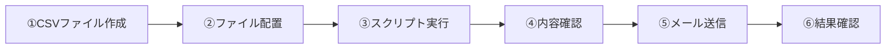

# 📖 利用者マニュアル

## 🎯 **はじめに**

外部メール送信システムは、CSVファイルに記載された宛先に対してメールを一括送信するシステムです。
銀行業務における口座開設通知、学校関連のお知らせ、届出変更通知などに利用できます。

## 📧 **システムの流れ**



## 📝 **CSVファイルの作り方**

### **必須項目**
| カラム名 | 説明 | 例 |
|----------|------|-----|
| メール送信日 | 送信済み管理用（空白で作成） | （空白） |
| メールアドレス | 送信先のメールアドレス | example@company.co.jp |
| メール件名 | メールの件名 | 口座開設のお知らせ |
| メール本文 | メールの本文 | 口座開設手続きが完了しました。 |

### **CSVファイルの例**
```csv
"メール送信日","メールアドレス","メール件名","メール本文"
"","customer1@example.com","口座開設のお知らせ","口座開設手続きが完了いたしました。ご不明な点がございましたらお気軽にお問い合わせください。"
"","customer2@example.com","重要なお知らせ","システムメンテナンスのため、下記の時間帯はサービスを停止いたします。"
```

### **⚠️ 重要な注意事項**

#### **ファイル名のルール**
ファイル名は以下の形式で作成してください：
```
[種別]_yyyy_mm_dd hh_mm_ss.csv
```

**利用可能な種別**：
- `口座_メール送信時に使用` - 口座関連の通知
- `学校_メール送信時に使用` - 学校関連の通知  
- `届出変更_メール送信時に使用` - 届出変更関連の通知

**例**：`口座_メール送信時に使用_2024_03_15 14_30_00.csv`

#### **文字コードの設定**
- **必須**: UTF-8 BOM付きで保存
- Excelで保存する場合は「UTF-8 (BOM付き)」を選択

#### **データの注意点**
- メールアドレスは正しい形式で入力（@マークを含む）
- 件名・本文に特殊文字（"など）を使う場合は注意
- 1行目は必ずヘッダー行として使用

## 📂 **ファイルの配置場所**

### **配置先**
```
\\goa-mailsv\UserData\
```

### **配置方法**
1. エクスプローラーで上記フォルダを開く
2. 作成したCSVファイルをコピー
3. ファイル名・文字コードが正しいことを確認

## ▶️ **システムの実行**

### **手動実行**
1. `\\goa-mailsv\UserData\` にある「InspectingAndMovingInputData.ps1 - ショートカット」をダブルクリック
2. 実行時間のチェック（8:00-18:00のみ実行可能）
3. CSV内容の自動チェック

### **確認ダイアログ**
```
OKを押下したら処理が行われます。

対象ファイル: 1 件
未送信行(送信候補): 50
警告: 0 件

[OK] [キャンセル]
```

- **対象ファイル**: 処理するCSVファイル数
- **未送信行**: 今回送信される行数
- **警告**: 問題のある行数

### **結果の確認**
- 成功時: ファイルが自動的に削除される
- 失敗時: `送信処理に問題が発生しています。事務部に連絡してください` フォルダが作成される

## 🔄 **自動処理（JP1）**

システムは5分間隔で自動実行されます：
1. CSVファイルを配置
2. 5分以内に自動でメール送信が開始
3. 送信完了後、ファイルは自動削除
4. エラー時は元の場所にファイルが戻される

## ✅ **送信状態の確認**

### **送信済みの判定**
- `メール送信日` カラムに日時が記録されている行は送信済み
- 再実行時は送信済みの行はスキップされる

### **送信履歴の確認**
送信が完了すると、CSVファイルの `メール送信日` カラムが以下のように更新されます：
```csv
"メール送信日","メールアドレス","メール件名","メール本文"
"2024-03-15 14:35:22","customer1@example.com","口座開設のお知らせ","..."
"2024-03-15 14:35:25","customer2@example.com","重要なお知らせ","..."
```

## ⚠️ **エラー対応**

### **よくあるエラーメッセージ**

#### **「時間制限エラー」**
```
今の時間は起動を許可されていません。
実行可能時間: 8:00-18:00
```
**対処法**: 営業時間内（8:00-18:00）に再実行してください。

#### **「ファイル名形式エラー」**
```
ファイル名の形式が間違っています。
正しい形式: [CsvKeyword]_yyyy_mm_dd hh_mm_ss.csv
```
**対処法**: ファイル名を正しい形式に変更してください。

#### **「CSVファイル書式エラー」**
```
CSVファイルがUTF-8 BOM付きではありません！
```
**対処法**: ファイルをUTF-8 BOM付きで保存し直してください。

#### **「必須カラムエラー」**
```
必須カラム 'メールアドレス' がありません
```
**対処法**: CSVファイルに必須のカラムを追加してください。

### **エラー時の対応手順**

1. **エラーメッセージを確認**
   - 画面に表示されるメッセージを読む
   - 原因を特定する

2. **ファイルの修正**
   - エラー内容に応じてCSVファイルを修正
   - 文字コード・ファイル名を確認

3. **再実行**
   - 修正後、再度スクリプトを実行
   - 同じエラーが続く場合は事務部に連絡

4. **緊急時の連絡**
   - システム管理者: admin@company.co.jp
   - 技術サポート: support@company.co.jp

## 📊 **制限事項**

### **ファイルサイズ**
- **推奨**: 1,000行以下
- **最大**: 10,000行（メモリ制限により）

### **同時実行**
- **制限**: 1つのプロセスのみ実行可能
- **多重起動**: 自動的に防止される

### **送信頻度**
- **制限**: SMTPサーバーの制限に依存
- **推奨**: 1時間あたり1,000通以下

### **メールアドレス**
- **形式**: RFC準拠のメールアドレス
- **文字数**: 320文字以内推奨

## 🔒 **セキュリティ・プライバシー**

### **個人情報の取り扱い**
- CSVファイルには個人情報が含まれる可能性があります
- ファイルの管理は社内規定に従ってください
- 不要になったCSVファイルは適切に削除してください

### **メール送信の記録**
- 送信履歴はログファイルに記録されます
- ログは2年間保管されます
- 監査用途でBCCに指定アドレスが自動追加されます

### **アクセス権限**
- システムへのアクセスは許可されたユーザーのみ
- 不正使用を発見した場合は速やかに報告してください

## 💡 **Tips・コツ**

### **効率的な利用方法**
1. **テンプレートの活用**
   - よく使用する形式はテンプレートとして保存
   - 件名・本文のパターンを事前に準備

2. **段階的なテスト**
   - 本番前に少数件でテスト送信
   - 件名・本文の表示確認

3. **バックアップの活用**
   - 重要なファイルは手動でもバックアップ
   - 処理前の状態を保存

### **トラブル回避**
1. **事前チェック**
   - ファイル名の確認
   - メールアドレスの形式確認
   - 文字コードの確認

2. **定期的なメンテナンス**
   - 不要ファイルの削除
   - ログファイルの確認

## 📞 **お問い合わせ**

システムに関するご質問・トラブルは以下までご連絡ください：

- **一般的な質問**: support@company.co.jp
- **緊急時**: emergency@company.co.jp  
- **システム管理者**: admin@company.co.jp

**営業時間**: 平日 9:00-17:00
**緊急時対応**: 24時間（重大障害のみ）